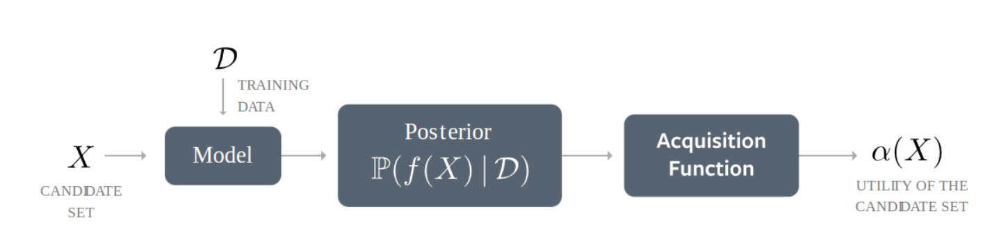

# Baysian Optimisation Package on Scintillation Timing Tuning at the SNO+ Experiment

## Overview
Timing information is essentail to the analysis in the SNO+ Experiment. The correct timing can differentiate signal from noise, to enhance the purity of signals. As a liquid scintillator-base experiment, it is needed to calibrate the overall scintillation timing during the cocktail constitution changes.  
Basically, the emission of scintillator photons can be parametrised in following empirical form
    $$P(t)=\sum_{i=1}^{i=4}A_i\frac{e^{-t/t_i}-e^{-t/t_r}}{t_i-t_r}$$
where $(t_i,A_i)$ are the decay timing pairs and $t_i$ represents the rising time. The timing distribution, tres, can be used for parametrising the scintillation timing parameters. It is defined as:
    $$t_{res} = t_{PMT} - t_{TOF} - t_{Det}$$ 
where $t_{PMT}$,$t_{TOF}$ and $t_{Det}$ denote as PMT hit time, time of flight between photon collaction and emission point and detection time. However, this physical parameter is not pure scintillator timing but convolved with optical process such as absoption, scattering and detector response. Therefore, one can only rely on repetitive simulation until matching with data. In the past, researchers dealt with this problem with violent grid scan, in other words scanning through parameter space independently to find the parameter set that produced the best match. Fortunately, this package provides a optimisation method to mathematically propose the most valuable point to simulate in each iteration, reducing the covergence period. 
   
## Introduction to Bayesian Optimisation
The core idea of bayesian optimisation is that it improves prediction posteriorly, based on prior measurements the program simulated. It is applied to the problems where fully parametrised the black box function is computing-expensice, and baysian optimisation evaluates the function adaptively with the proposal of measurements. The goal is to determine the parameter set returned the near-optimal objectives after a number of evaluations. The full bayesian process are operated from two main functions and can be illustrated by the following flow chart:

  
Figure 1: bayesian optimisation full procedure from https://botorch.org/docs/overview 

### 1. Surrogate Function
Surrogate function is the "guess" for the objective from posterior measurements. In this scenario, it is the $\chi^2$ over the 9 dimension timing space. This calibration work uses Gaussian Process (GP) to parametrise the full objective distribution from multivariate normal distribution. It consists of a mean function $\mu(\vec{X})$ and covariance kernel $k(x,x^{pron})$.
There are several choices of function form for kernel, and the most common one is Radial Basis Kernel (RBF), which is formulated by
    $$K_{RBF}(\vec{x}, \vec{x'}) = \exp\left( -\frac{\|\vec{x} - \vec{x'}\|^2}{2\ell^2} \right)$$
The strength of correlations between two parameter values, $l$, is a tunable quantity and can be optimised in each iteration. For 
Surrogate predicts mean and uncertainty adaptively using this mean and kernel from the posterior distributions over the outputs. I would not bored you with formulae, but the take home message is that the prediction will get closer to the truth after interative measurements.     
### 2. Acquisition Function
Acquisition function will receive the mean and uncertainty from surrogate's prediction, to provide a/several points for the next round of simulations. In this package, only single point is retrieved from acquition function. Therefore, the type of acquition function being chosen and the maximisation method are key to reduce the iterations while keeping a good covergence condition. In the BoTorch, it provides two methods, Expected Improvement (EI) and Monte-Carlo Acquisition Functions. First one is used for simplicity, and it is enough and appropriate in low dimensionality problems. 
### Expected Improvement (EI)
Improvement ($I(\vec{x})$) is calculated by getting objective from the worst measurement (highest $\chi^2$) subtracting with that in prediction. The formula can be wrtten as
$ I(\vec{x})= max[\chi^2(x^*)-\chi^{2}(x),0]$ 
Intuitively, the most valuable point of simulation is the point with biggest improvent, showing the extent of gain quatitatively we can have from simulating this point. However, the uncertainty at point $\vec{x}$ shall be considered and we know the prediction values from surrogate is followed as a gaussian distribution with mean $\mu(x)$ and uncertainty $\sigma(x)$. Therefore, a weighting factor borrowed from density function is applied to the Expected Improvement:

$$<I(x)> = \int^{\infty}_{-\infty} I(x) \text{Gaus}(\mu(x), \sigma^{2}(x)) d\chi^2(x)$$

Fortunately, this integral can be solved analytically by changing variable $z_{0}=\frac{\chi^2(x)-\mu(x)}{\sigma(x)}$ to change gaussian to be a normal density function. The final form of expected improvement is just $$(\chi^2(x^*)- \mu(x))N_{c}(< z_{0}|0,1) + \sigma(x)N(z_{0}| 0,1)$$, where $N_{c}$ and $N$ are a CDF value at z a PDF value in the normal distribution. 

However, even in 9 dimensions, performing optimisation searches in the acquisition is a pain. Traditionally, in this classical method, BoTorch will take a few inital points randomly and gradually climbed up from the analytic gradients until maximum is found.

In the SingleGP case, which is used in this package, the hyperparameters such as length scale (l) to control the covariance, or the noise level under the covariance matrix, are masimised under automated relevance determination (ARD):
$$log(p(\chi^2 | X,\theta  ))=-\frac{1}{2}(\chi^2)^{T}K^{-1}(\chi^2)-\frac{1}{2}log(| K |)-\frac{n}{2}log(2\pi)$$
The best hyperparameters set is chosen by maximising this marginal likelihood by gradient optimser.

### MC-based Acquisition Function
(Optional Reading)
Two sets of problem are suitable for this use.
1. In the hi dimension parameters space when optimising the hyper-parameters using the ARD function. It is hard to converge and oftenly overconfident on the hyperparameters. Therefore, instead of taking the posterior GP from a given set of hyperparameter, a set of GP from plausible hyperparameters sets are included. This is the reason of the posterior not being gaussian anymore so the EI closed form might be failed.
2. multi-points outputs with correlation 
Normally there are no close-form solutions of EI in this case of the posterior GP.

Therefore, a MC-based acquisition function comes and serves a good approximation on finding valuable simulation point(s).

Botorch uses Monte-Carlo sampling to use the sample average to approximate the function. It simulates based on GP process each time but a reparametrisation trick can be used to enable stable gradients, efficient on optimisation. The acquisition here still uses EI, but instead of doing the integral, it get the expectation from sampling from that given proposed point. The sampling values can also be given from multiple GP but using different hyperparameter set for example (in case 1). However,a reparametrising was developed and introduced $eqsilon$, with requirement of $\epsilon=N(0,1)$. The value of the posterior surrogates are reparameterised as $$\chi^(2)(x) =\mu(x)+\sigma(x)\epsilon$$. If there are multiple means and uncertainties, it is just doing the average. The mean and uncertainty are deterministic terms while all randomness components are controlled by $\epsilon$. Therefore, the gradient $\partial(Acq(x)/\partial x)$ is calculable, because $\mu(x)$ and $\sigma(x)$ are smooth and differentiable. 

## Code Instruction
* Several external packages and libraries are required in advance:
    * Virtual Python Environment with
        * PyTorch >= 2.8.0+cu128
        * BoTorch >= 0.10.0
        * Matplotlib
        * numpy
    * RAT with dependencies
    * HTCondor
User should try to find the packages that is compatible with ROOT version linked with RAT. For example, in version of `7.0.15`, people should use `python3.9`. 

### Codes Structure
There are two dag files in a nested structure. `training.dag` controls the submission subdag `opto.dag`, if the covergence has not been met. Inside the `opto.dag`, it will firstly run the simulation based on parameters values in `currentparams.json`, calculating $t_{res}$ from `src/time_residuals.py`, then proposing the next point from the execution of `src/select_parameters.py`. The looping will be terminated once the covergence is reached. 

### Run Command
This package is assumed user have already owned the Bi214 and Po214 tres in the format of `.npy`. If not, please use the usual BiPo214 cut windows to select candidates, and then retriving these candidates in the RATDS data files and perform the similar function in `extract_residuals()` in `src/time_residual.py`

1. From the fresh start, it is recommended to run the setup 

    `python initial.py` at `..../pytor_bayesian_opti` level

    and fill in dependenies path to produce necessary path variables and empty directories.

2. Please change the path of inputpaths in `rat.dsreader()` and `np.load()` at function `src/   time_residual.py` `cal_objective()` respectively.

3. The following step will be 
    `./clean_files.sh` to remove any leftover results from the last tuning.

4. The Final step is start running the tuning is

    `condor_submit_dag dag_running/train.dag`, and the maximum iteration is 1000, but it can be changed up to user's choice.
5.  With steps above, log files, macros, parameter values and pretty plots should be automatically  filled in `result/condor_logs`, `result/macros`, `result/pars` and `result/plots` in each iteration. 
6.  In the end, plots of loss as a function of iterations, in both log and normal scale, can be     generated by 
`python utils/plot_chi2_iter.py` 
in `result/plots`. 

7. If user is interested in two models's comparison along with data, user should revise the directory in `utils/twomodels_comparison.py`  and run it with python command.

